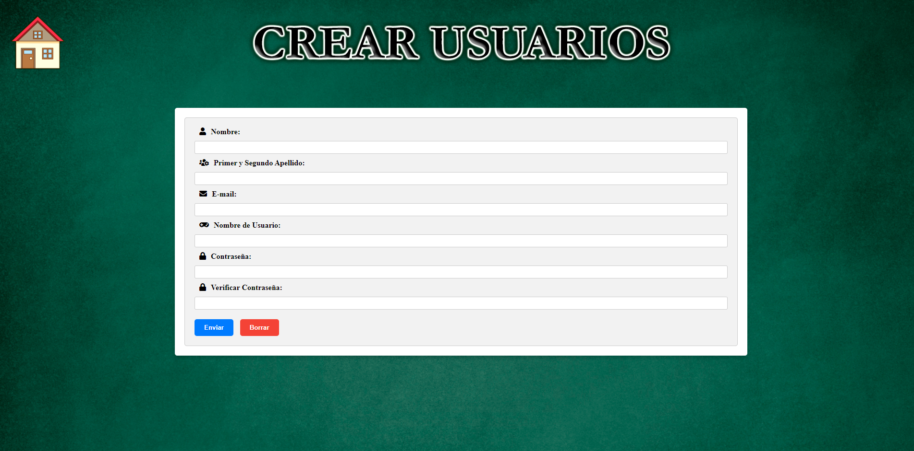
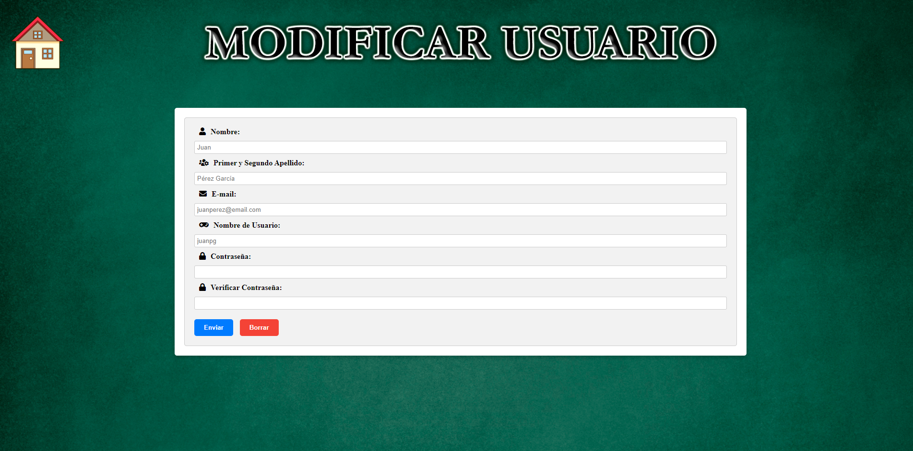

# PaginaWeb-usando-Servidores

Proyecto final de la asignatura de Tecnologías Web del 3 año de Ingeniería Informática

## Descripción

El proyecto consiste en crear una aplicación web para la gestión de rutas de caminos en Extremadura.

La aplicación tiene 2 diferentes versiones: 

- **Usuario**: cualquier persona que se registre y se logueé puede acceder a ver las rutas, reservar una o varias rutas y gestionar sus reservas.

- **Administrador**: el administrador puede tanto gestionar las rutas (crear, actualizar o eliminar las rutas) como los usuarios (crear, editarlos o borrarlos).

## Ejecución de la práctica

Dependiendo del puerto donde se tenga instalado el Tomcat, la dirección URL cambiará. La dirección es la siguiente:

 ```sh
  http://localhost:8082/EF2_Rutas/
  ```

## Tecnologías Usadas

### Java EE
Tecnología usada para crear el proyecto siguiendo el modelo Cliente - Servidor (petición/respuesta)

### Maria DB (Dbeaver)
Base de Datos relacional donde se configura la conexión en el fichero context.xml


### Servlet y JSP
Vistas dinámicas de la aplicación la cual gracias al controller, recibo en la request los objetos para crear esta vista.

## Capturas de pantalla del proeycto

### Inicio (publica)

### VerRutasNoLogin (pública)

### Registro (pública)

### Login (pública)


<hr><hr>

### Usuario Inicio (privada)


### Usuario Ver Rutas (privada)


### Usuario Hacer Valoración (privada)


### Usuario Ver Valoración (privada)


### Usuario Ver Novedades (privada)


### Usuario Ver Reservas (privada)


<hr><hr>

### Admin Inicio (privada)


### Admin Crear Usuario (privada)


### Admin Ver Usuarios (privada)


### Admin Modificar Usuario (privada)


### Admin Añadir Ruta (privada)

